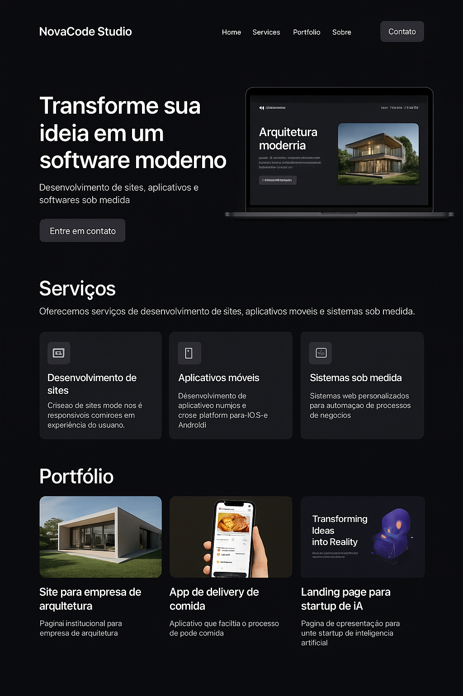

# Salatiel Gomes | NovaCode Studio





Portfólio pessoal e página de contato prontos para deploy no **Vercel**.


## Resumo
- **Nome:** Salatiel Gomes
- **Marca:** NovaCode Studio (marca secundária)
- **WhatsApp:** +55 48 99828-4253
- **E-mail:** salatiel67@live.com
- **Tema:** Dark mode

## Rodar localmente
```bash
npm install
npm run dev
# Abra http://localhost:3000
```

## Deploy no Vercel (recomendado)
1. Crie um repositório no GitHub chamado `salatielgomes-novacode`.
2. Faça push do código.
3. Vá em https://vercel.com, clique em **Add New Project** e importe o repositório.
4. Configure variáveis de ambiente (opcional) para EmailJS (veja abaixo).

## Formulário (EmailJS)
O projeto está pronto para EmailJS. Para ativar:
1. Crie uma conta em https://www.emailjs.com
2. Crie um **Service** e anote o `Service ID`.
3. Crie um **Template** com campos `from_name`, `reply_to` e `message` e anote o `Template ID`.
4. No painel de usuário do EmailJS, copie sua **Public Key**.
5. No Vercel, adicione as variáveis:
   - `NEXT_PUBLIC_EMAILJS_SERVICE_ID`
   - `NEXT_PUBLIC_EMAILJS_TEMPLATE_ID`
   - `NEXT_PUBLIC_EMAILJS_PUBLIC_KEY`

Quando configurado, o formulário enviará mensagens para o e-mail configurado no template. O assunto sugerido está definido como:
> **Nova mensagem recebida do site de Salatiel Gomes**
